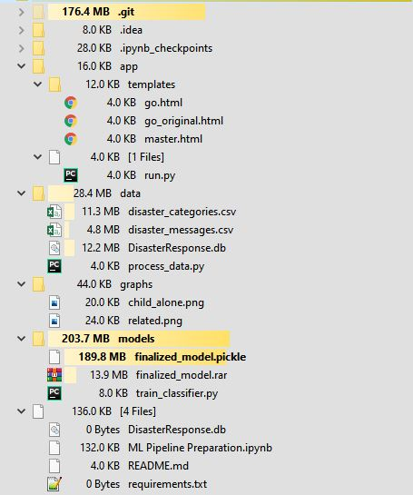
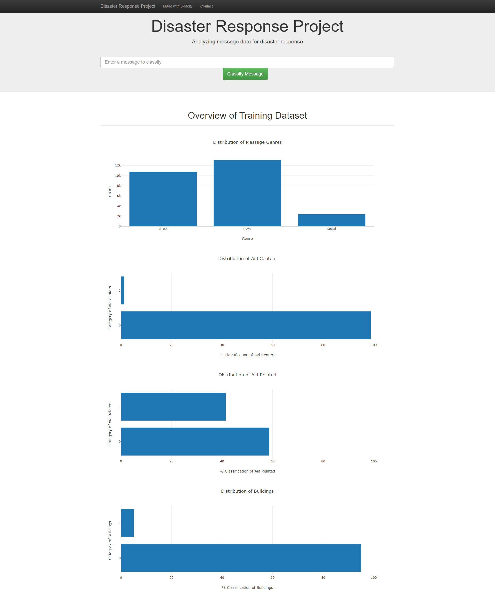
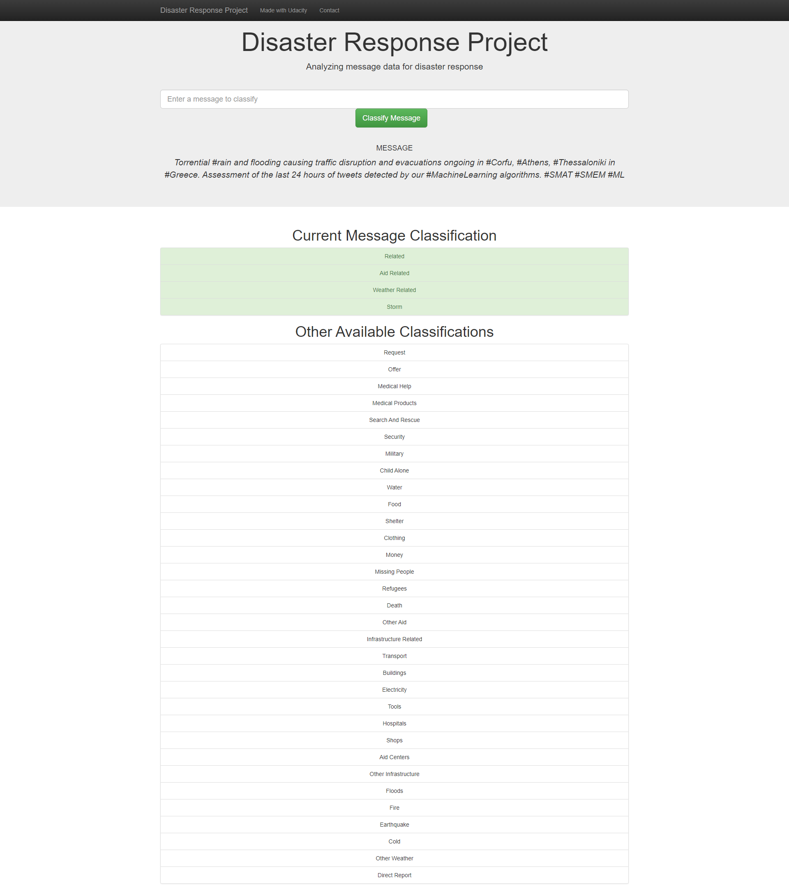
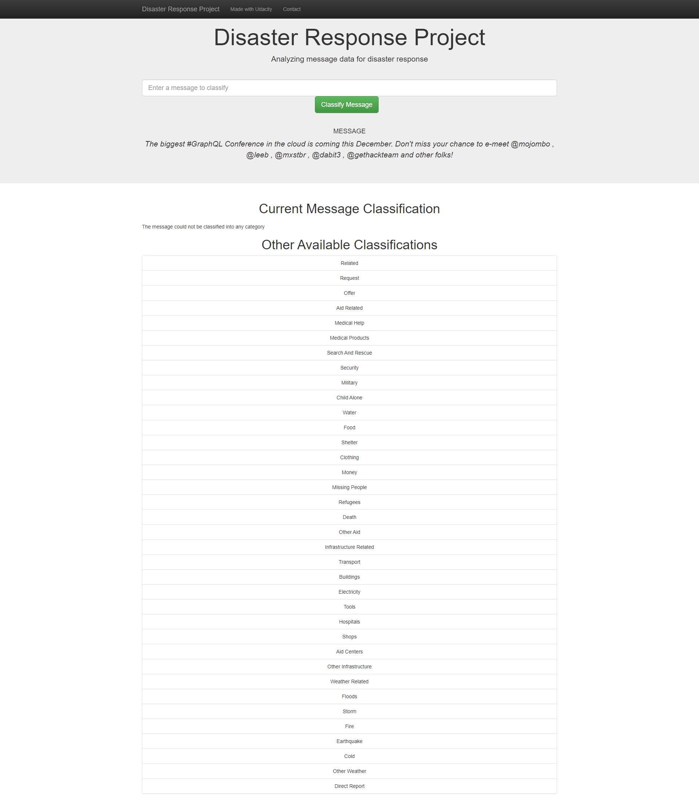
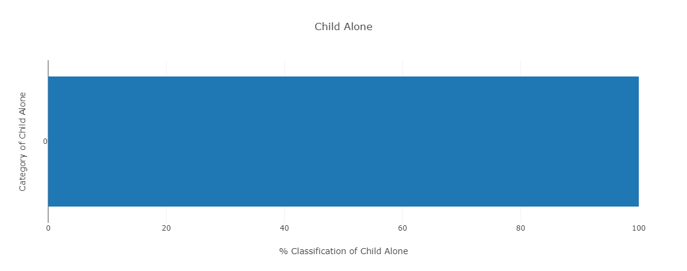
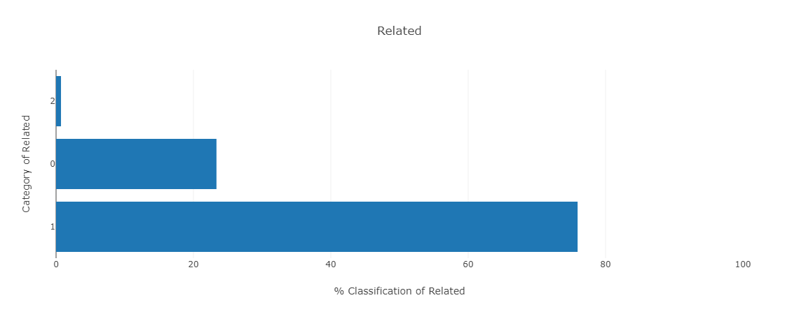
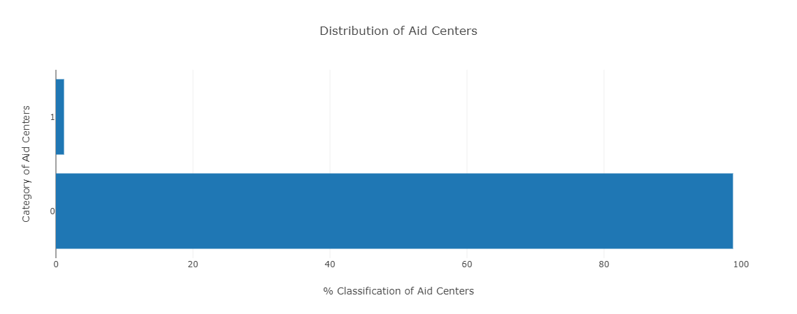
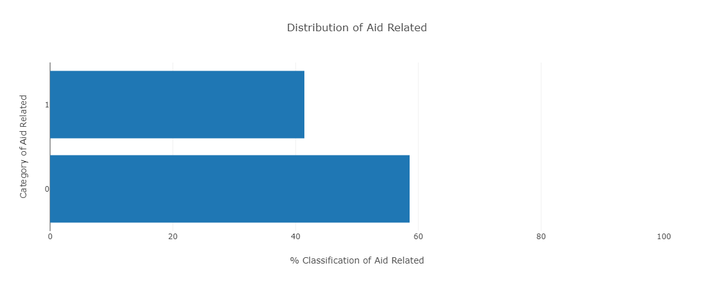

# Disaster Response Pipeline Project

## Table of Contents

1. [Installation](#installation)
2. [Directory Structure](#dir_structure)
3. [Instructions](#instructions)
4. [Example Working](#examples)
5. [Analysis of the Various Categories](#analysis)

6. [About Me](#about)

## Installation 

The code should run with no issues using Python versions 3.*.

## Directory Structure 

## Instructions 
1. Run the following commands in the project's root directory to set up your database and model.

    - To run ETL pipeline that cleans data and stores in database
        `python data/process_data.py data/disaster_messages.csv data/disaster_categories.csv data/DisasterResponse.db`
    - To run ML pipeline that trains classifier and saves
        `python models/train_classifier.py data/DisasterResponse.db models/finalized_model.pickle`

2. Run the following command in the app's directory to run your web app.
    `python run.py`

3. Go to http://127.0.0.1:3001/

>Notes:
>1. Because the training of the model takes a long time (over 1hr), the pickle file has been included to avoid training everytime
>2. The pickle file has been zipped to be able to upload it to github. When you clone/download the repo, just unzip the pickle file

#Example Working
Te Home Page shows the analysis of all categories in the training data

This tweet https://twitter.com/GlobalFloodNews/status/1448943021576294430 has been classified into 4 catogories

This tweet https://twitter.com/GraphQLGalaxy/status/1451291277958471682 is about a completely unrelated subject and returns no classification at all.

# Analysis of the Various Categories 
## Less than one option categories
 ### Child Alone
All values of messages did not have any <i>child_alone</i> category (all were 0). This implies no tweet will ever have 
a prediction of 1.

Deleting this category from the model may not have impact on the outcome of predictions

##More than two option categories
###Related
The <i>related</i> category have 0, 1 & 2 options, with the 2 consisting of less than 1%.

##Imbalanced Categories
Majority of the categories had imbalanced classifications

###Aid Centers
This had only two classifications, 0 and 1, but were so imbalanced with 1 only accounting for 1.2% of all messages.
 

Other categories with this imbalanced message categorizations were:
- buildings with 1 at 5.1%
- clothing with 1 at 1.5%
- cold with 1 at 2%
- death with 1 at 4.6%
- earthquake with 1 at 9% 
- elecricity with 1 at 2%
- etc

##Balanced Categories
These had a relative closeness in the message categorizations with neither 0 nor 1 taking up less than 30% f the total message classifications
###Aid Related
Had a good message classification with 1 at 42% of the messages

##About Me 
- <a href="https://www.linkedin.com/in/mcoluga/">LinkedIn</a>
- <a href="https://twitter.com/McOluga">Twiiter</a>